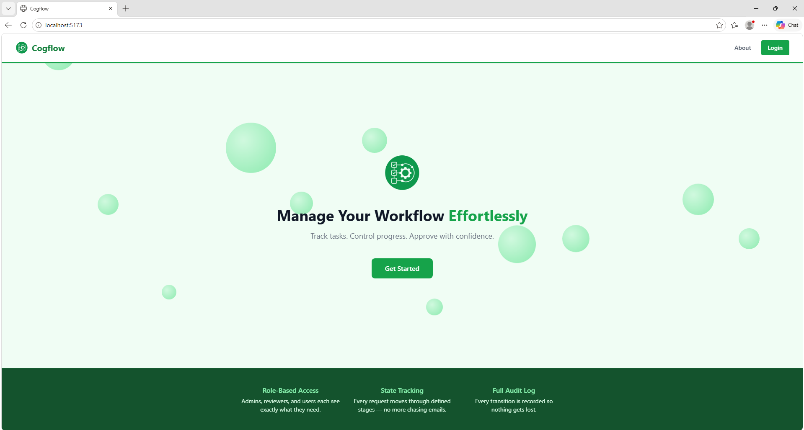
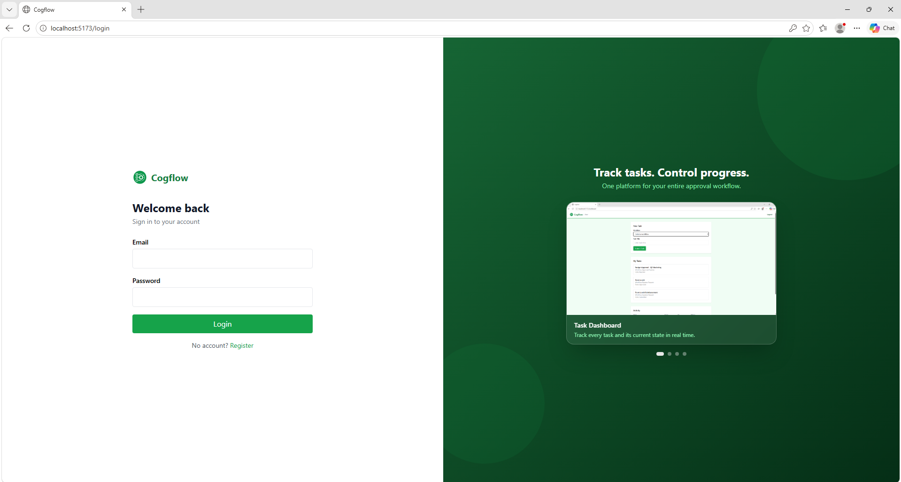
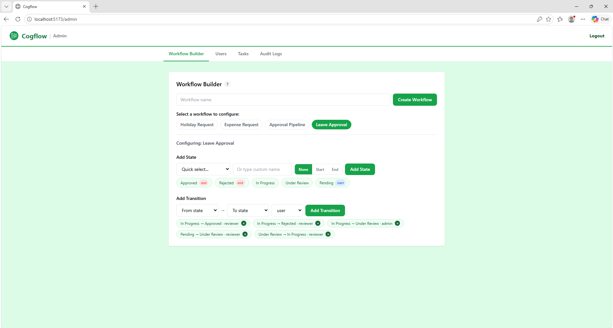
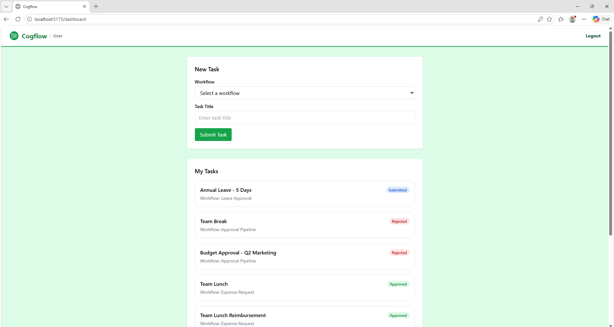
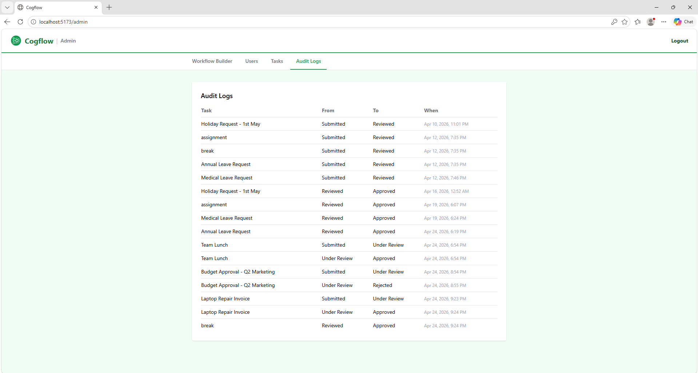

# Cogflow

A role-based workflow engine that models business approval processes as state machines. Admins define workflows with states and transitions, users submit tasks that move through those states, and every transition is recorded in an audit log.

Built with FastAPI, PostgreSQL, and React.

## Screenshots



<table>
  <tr>
    <td></td>
    <td></td>
  </tr>
  <tr>
    <td></td>
    <td></td>
  </tr>
</table>

## Features

- JWT authentication with role-based access control (admin, reviewer, user)
- Admin panel to build workflows: define states, transitions, and required roles
- Users submit tasks that are automatically placed in the initial state
- Role-enforced state transitions — only authorised roles can move a task forward
- Full audit log of every state transition
- Admin user management: create and deactivate accounts

## Project Structure

```
role-based-workflow-engine/
├── backend/        # FastAPI application
├── frontend/       # React (Vite) application
└── docs/           # Architecture diagrams and requirements
```

## Tech Stack

- **Backend**: Python 3.12, FastAPI, SQLAlchemy, Alembic, PostgreSQL
- **Auth**: JWT (python-jose), bcrypt (passlib)
- **Frontend**: React 18, Vite, Tailwind CSS, Axios
- **Testing**: Pytest

## Prerequisites

- Python 3.12+
- Node.js 18+
- PostgreSQL (or Docker to run it in a container)

## Getting Started

### 1. Start the database

```bash
docker run --name workflow-db -e POSTGRES_PASSWORD=postgres -e POSTGRES_DB=workflow -p 5432:5432 -d postgres
```

Or point `DATABASE_URL` in `.env` at an existing PostgreSQL instance.

### 2. Backend

```bash
cd backend
python -m venv .venv
source .venv/bin/activate  # Windows: .venv\Scripts\activate
pip install -r requirements.txt
cp .env.example .env       # fill in your values
alembic upgrade head
python seed.py             # creates the first admin account
uvicorn app.main:app --reload
```

API docs available at: `http://localhost:8000/docs`

### 3. Frontend

```bash
cd frontend
npm install
npm run dev
```

App runs at: `http://localhost:5173`

## Default Admin Credentials

Created by `seed.py`:

| Field    | Value             |
|----------|-------------------|
| Email    | admin@example.com |
| Password | changeme123       |

Change these after first login.

## Running Tests

```bash
cd backend
pytest tests/
```

## Known Limitations

- Workflow misconfiguration can create dead-end states; builder highlights but does not fully prevent them.
- Reviewer and user share a unified dashboard, limiting role-specific UX.
- No real-time or in-app notifications; users must manually check task status.

## Design Decisions

- Role-based access control enforced strictly at the backend; client cannot bypass it.
- JWT stored in localStorage for simplicity; production should use secure httpOnly cookies.
- Schema migrations managed with Alembic for versioning and rollback.

## Roadmap

- Deploy backend to Railway or Render and frontend to Vercel
- Add real-time notifications (WebSockets or polling fallback)
- Enforce strict workflow validation before task creation
- Introduce multi-tenancy
- Mobile client using React Native + Expo
