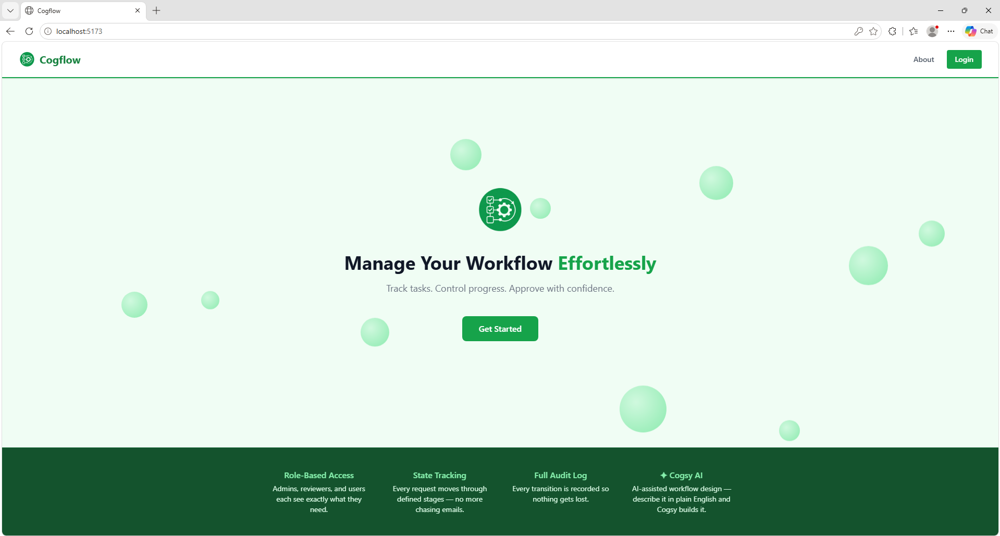
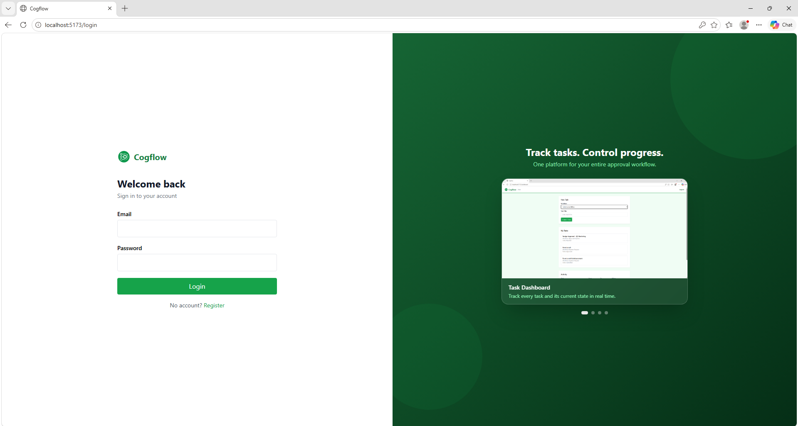
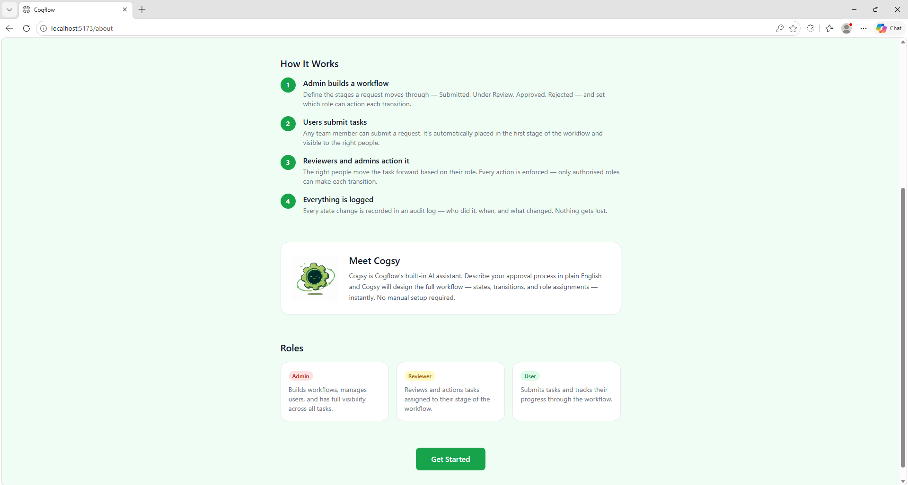
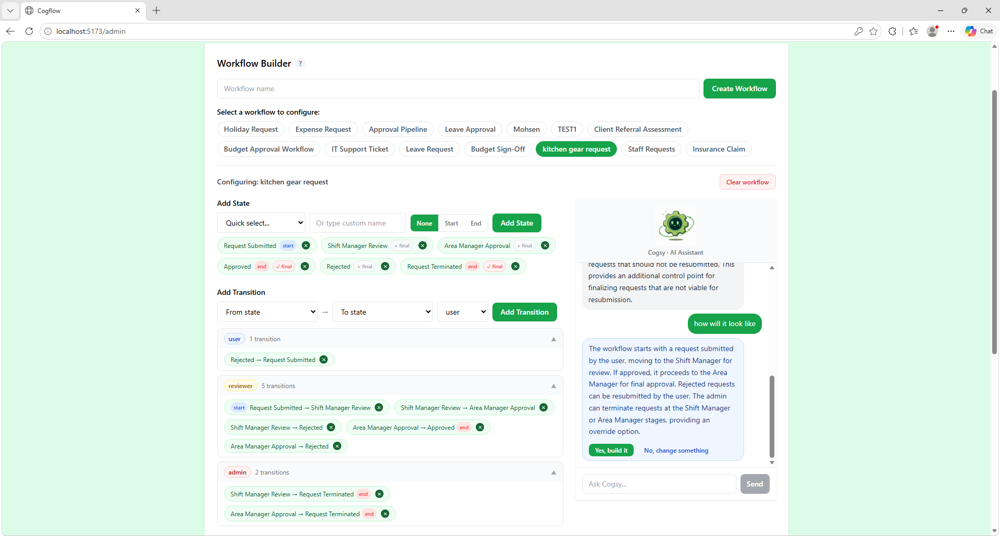
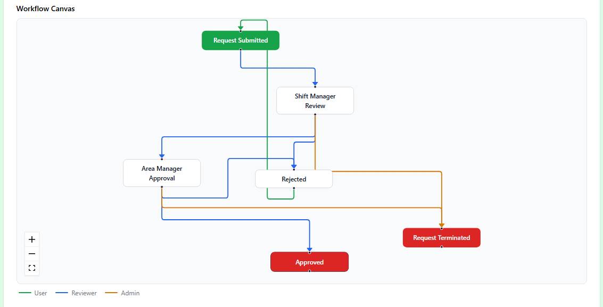
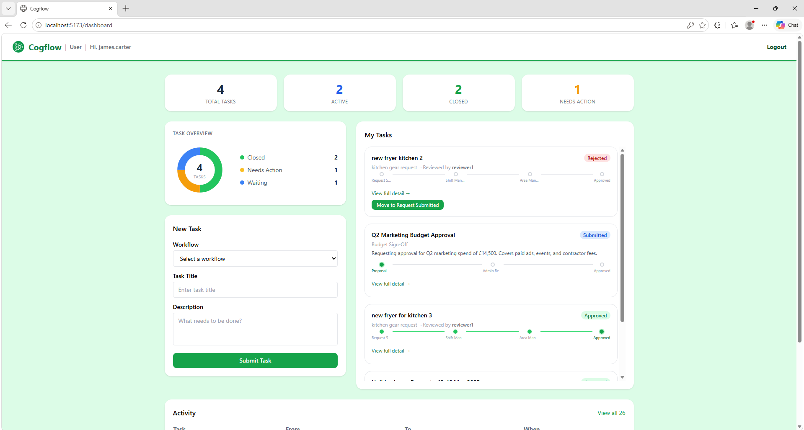
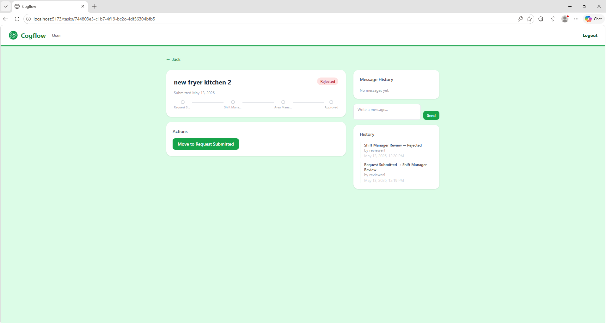
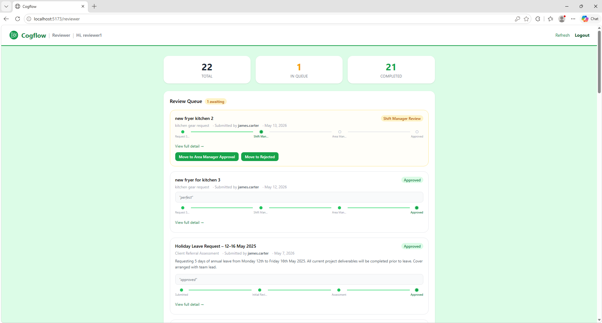
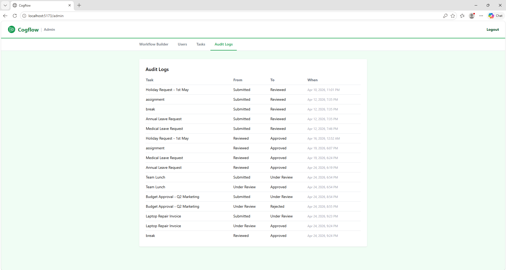

# Cogflow

Built with FastAPI, React, PostgreSQL, and GPT-4o.

## Project Summary

Cogflow is a full-stack workflow automation platform for modelling approval processes as role-based state machines. Admins define workflows visually, users submit tasks, reviewers move tasks through authorised transitions, and every change is recorded in an audit log.

The project demonstrates backend-enforced RBAC, state-machine transition validation, PostgreSQL persistence, auditability, and AI-assisted workflow generation through Cogsy, a GPT-4o-powered assistant.

## Screenshots



<table>
  <tr>
    <td align="center"><sub>Login</sub></td>
    <td align="center"><sub>About</sub></td>
  </tr>
  <tr>
    <td></td>
    <td></td>
  </tr>
  <tr>
    <td align="center"><sub>Workflow Builder</sub></td>
    <td align="center"><sub>Workflow Canvas</sub></td>
  </tr>
  <tr>
    <td></td>
    <td></td>
  </tr>
  <tr>
    <td align="center"><sub>User Dashboard</sub></td>
    <td align="center"><sub>Task Detail</sub></td>
  </tr>
  <tr>
    <td></td>
    <td></td>
  </tr>
  <tr>
    <td align="center"><sub>Reviewer Dashboard</sub></td>
    <td align="center"><sub>Audit Logs</sub></td>
  </tr>
  <tr>
    <td></td>
    <td></td>
  </tr>
</table>

## Features

**Core**
- JWT authentication with role-based access control (admin, reviewer, user)
- Admin panel to build workflows: define states, transitions, and required roles per transition
- Visual workflow canvas showing the state machine as a graph
- Users submit tasks that are automatically placed in the initial state
- Role-enforced state transitions — only authorised roles can move a task forward
- Full audit log of every state transition with timestamps
- Admin user management: create and deactivate accounts
- Dead-end state detection — the builder highlights states with no outgoing transitions

**Cogsy — AI Workflow Assistant**
- Integrated GPT-4o chat assistant for designing workflows from plain English descriptions
- Preview flow — Cogsy describes the plan before building, prompting the admin to confirm
- Redundancy detection — flags conflicting or redundant transitions with an explain-and-confirm pattern
- Multi-turn conversation history scoped per workflow, persisted in localStorage
- Role interpretation — correctly maps business language ("admin can terminate") to workflow structure
- Animated mascot with idle, thinking, and cheer states reflecting the assistant's current activity
- Apply-without-second-call pattern — flagged workflows held in pending state, saved only on confirmation

## Tech Stack

- **Backend**: Python 3.12, FastAPI, SQLAlchemy, Alembic, PostgreSQL
- **Auth**: JWT (python-jose), bcrypt (passlib)
- **AI**: OpenAI GPT-4o via the OpenAI Python SDK
- **Frontend**: React 18, Vite, Tailwind CSS, Axios
- **Testing**: Pytest with SQLite test database

## Project Structure

```
role-based-workflow-engine/
├── backend/        # FastAPI application
│   ├── app/
│   │   ├── api/        # Route handlers (auth, workflows, tasks, ai, audit)
│   │   ├── models/     # SQLAlchemy models
│   │   ├── schemas/    # Pydantic schemas
│   │   ├── services/   # Business logic
│   │   └── core/       # Auth, config, dependencies
│   └── tests/          # Pytest test suites
├── frontend/       # React (Vite) application
│   └── src/
│       ├── components/ # WorkflowCanvas, MascotChat
│       ├── pages/      # Admin, Reviewer, User dashboards
│       ├── api/        # Axios API clients
│       └── hooks/      # useAdmin, useReviewer
└── docs/           # Architecture diagrams and screenshots
```

## Getting Started

### Prerequisites

- Python 3.12+
- Node.js 18+
- Docker (for PostgreSQL)
- OpenAI API key

### 1. Start the database

```bash
docker run --name workflow-db -e POSTGRES_PASSWORD=postgres -e POSTGRES_DB=workflow -p 5432:5432 -d postgres
```

### 2. Backend

```bash
cd backend
python -m venv .venv
source .venv/bin/activate  # Windows: .venv\Scripts\activate
pip install -r requirements.txt
cp .env.example .env       # fill in DATABASE_URL and OPENAI_API_KEY
alembic upgrade head
python seed.py
uvicorn app.main:app --reload
```

API docs: `http://localhost:8000/docs`

### 3. Frontend

```bash
cd frontend
npm install
npm run dev
```

App: `http://localhost:5173`

## Default Admin Credentials

Created by `seed.py`:

| Field    | Value             |
|----------|-------------------|
| Email    | admin@example.com |
| Password | changeme123       |

Change these after first login.

## Running Tests

```bash
cd backend
pytest tests/ -v
```

Tests use an isolated SQLite database and cover auth, workflows, states, tasks, transitions, and audit logs.

## Design Decisions

- Role-based access control enforced at the backend — the client cannot bypass it
- Cogsy uses a structured system prompt with explicit role interpretation rules to prevent common AI misinterpretations (e.g. "admin can terminate" generating approve/reject transitions instead)
- Warn/apply pattern avoids a second GPT call on confirmation — the pending workflow is held in frontend state and posted directly to `/ai/apply-workflow`
- JWT stored in sessionStorage (clears on tab close); production should use httpOnly cookies
- Schema migrations managed with Alembic

## Roadmap

- Deploy backend to Railway or Render, frontend to Vercel
- Real-time task notifications via WebSockets
- Multi-tenancy support
- Mobile client with React Native + Expo
